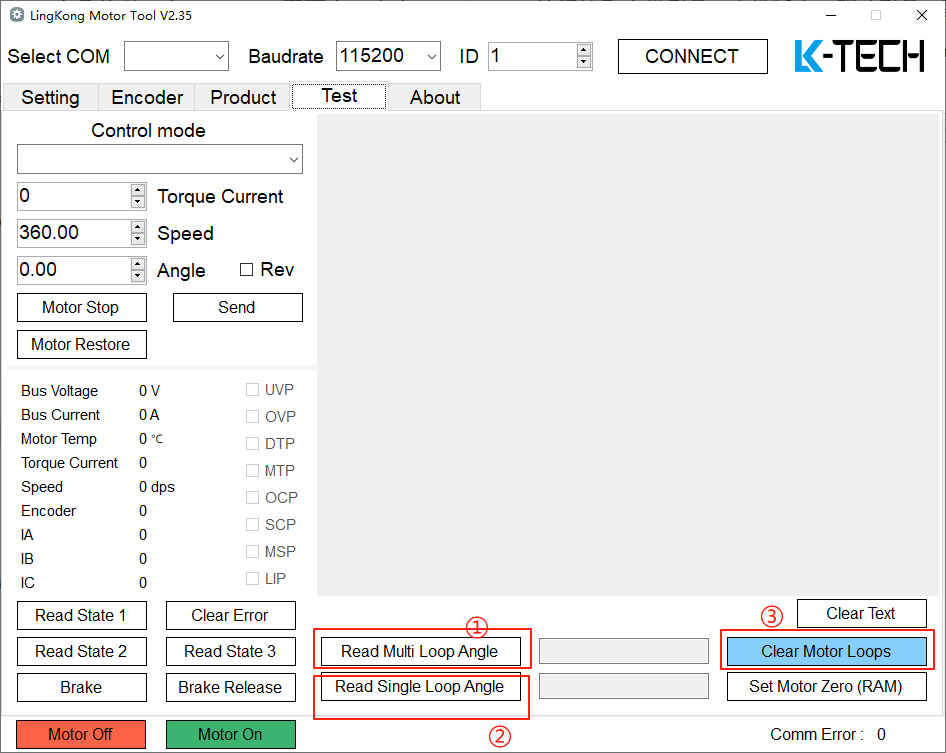

# adora_head_control_dora_node 节点

头部节点使用的是瓴控的MG4010E电机，在使用之前先利用reference文件夹（上海瓴控科技MG4010E-i10.zip）中的电机上位机对电机中位进行设置，并通过电机背部的拨码开关设置电机ID。

## 1 电机参数设置

### 1.1 电机ID设置方法

电机选用485通信方式，出厂默认通信波特率115200

目标：设置水平旋转轴位置上的舵机ID=2，俯仰方向的舵机ID=1。

电机ID通过电机背部的拨码开关设置，ID 由拨码开关选择:拨码开关与ID对应关系如下表:


### 1.2电机位置清零

电机设置ID以后，利用电机配套的线缆连接上位机，


在上位机界面上对编码器位置进行清零，如下图所示

- step1: 点击“read multi loop angle”
- step2: 点击“read single loop angle”
- step3: 点击“clear multi loops”



注意：若出厂时候电机安装的位置是水平、俯仰都处于居中位置，这样标定即可。


若无法使用上位机，则运行目录下的标定零点脚本"set_orin_mg4010e.py",该指令只能清除编码器多圈计数。若需要更高精度，此时可以通过手去扭动电机转子，调整在0附近。

```
python set_orin_mg4010e.py 
```

## 2 控制模式

head_control_driver_dora.py为dora环境下的头部节点，该节点发布两个云台电机的角度数据，同时接收两个角度，第1个角度表示俯仰方向的角度（输入范围 [-30/57.3 30/57.3]，单位弧度），第2个角度表示水平旋转方向的角度（输入范围 [-60/57.3 60/57.3]，单位弧度）

注：未进行标定之前不可运行节点 **adora_head_dora_node.yaml**

```
dora up 
dora start adora_head_dora_node.yaml --name head_control
```


## 3 电机API

MOTOR_MG4010E.py文件为电机的驱动API函数，在作为云台电机模式下，建议电机控制模式采用多圈位置控制模式（即：Multi Loop Angle Control 2）
