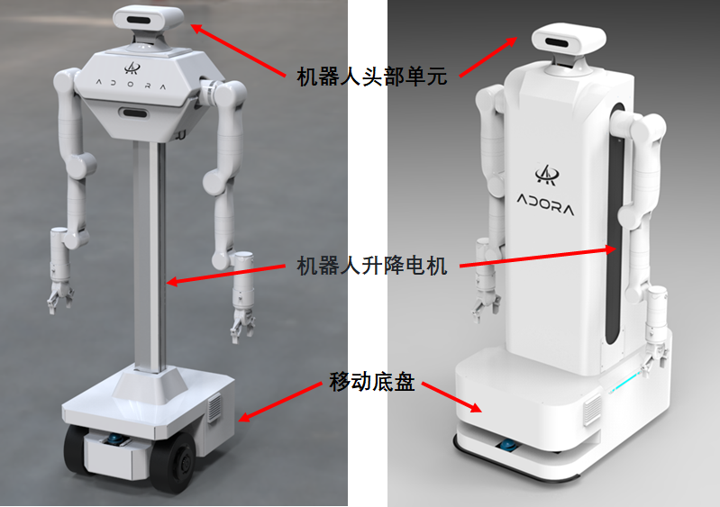

# 说明

## 1 目录说明

该目录为Adora机器人的驱动节点

adora_chassis_control 移动底盘节点

adora_head_control  机器人头部节点

adora_lifting_motor_control 机器人升降电机节点




## 2 多个USB设备访问技巧

- 当将多个相同型号的 USB 转串口适配器插入电脑时，系统通常会按检测顺序将它们分配为 `/dev/ttyUSB0`, `/dev/ttyUSB1` 等。
- **问题：** 如果重启电脑或重新插拔适配器，它们的顺序可能会改变（比如之前的 `ttyUSB0` 变成了 `ttyUSB1`）。这对于依赖固定设备名的脚本或程序（如 Arduino IDE 选择端口、串口通信程序）

### 2.1 通过rules文件解决权限问题，避免每次设备插入都需要赋予权限

```
在 /etc/udev/rules.d/ 目录下创建一个 adorarobots.rules 文件
```

```
cd /etc/udev/rules.d
sudo gedit adorarobots.rules
```

填入以下内容，自动给与串口权限

```
# set the udev rule , make the device_port be fixed by rplidar
#
#KERNEL=="ttyUSB*", ATTRS{idVendor}=="067b", ATTRS{idProduct}=="2303", MODE:="0777"
KERNEL=="ttyUSB*", ATTRS{idVendor}=="1a86", ATTRS{idProduct}=="7523", MODE:="0777"
```

 

 ### 2.2 **识别特定设备** 绑定芯片序列号

 输入命令查看制造商信息、产品型号和设备的唯一序列号

```shell
ls -l /dev/serial/by-id/
```

会看到类似这样的输出：

```shell
lrwxrwxrwx 1 root root 13 Jul 31 10:00 usb-FTDI_FT232R_USB_UART_A50285BI-if00-port0 -> ../../ttyUSB0
lrwxrwxrwx 1 root root 13 Jul 31 10:00 usb-Arduino__www.arduino.cc__0043_5573530303535180C0C1-if00 -> ../../ttyACM0
```

 为了确保每次访问的都是同一个物理串口设备时，不要使用 /dev/ttyUSB0 或 /dev/ttyACM0。应该使用 /dev/serial/by-id/ 目录下对应的完整符号链接路径。即

```
/dev/serial/by-id/usb-FTDI_USB__-__Serial_Converter_FT8J0QI3-if00-port0
```

 例如在 Python 的 `pyserial` 库中使用固定串口

```python
import serial
# 使用 by-id 路径打开特定的 Arduino
ser = serial.Serial('/dev/serial/by-id/usb-FTDI_USB__-__Serial_Converter_FT8J0QI3-if00-port0', 9600)
```

